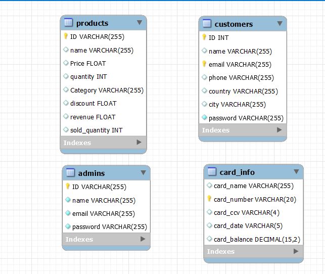

# Welcome to Story.
---
## Story is an online store project made on JAVA.

- Story is an application designed to empower businesses of all sizes to create and manage their online stores with ease. Whether you're a solo entrepreneur or an established retailer.
- Features :
	- This project use Database for storing and reading data.
	- List all products without needing to have account
		-	first list categories of products.
		-	List products of choosen category.
	- Customers could create personal account with personal info
		- ID (generated automatically by Database).
		- Full Name.
		- Email.
		- Phone.
		- Country.
		- City
		- Password
	- Customer have the ability to:
		- List the products as ususal vistor with information:
			- ID.
			- Name.
			- Price.
			- Avilable Quantity.
			- Category.
			- Discount.
		- List information about specific product by product ID.
		- Every Customer have carte and can:
			- add product to carte
			- Remove product from carte.
			- List carte 's products.
	- Make payment (now cridit cared are avilable) by providing:
		- Card number.
		- Card expire date.
		- Card CCV.
	- Customer can list his information
	- Accounts for Admins and have the ability to :
		- List products with full information including:
			- ID.
			- Name.
			- Price.
			- Avialble Quantity.
			- Category.
			- Discount.
			- Revenue.
			- Sold quantity.
		- Add new product to database by providing full info of product.
		- Modify product info into database through product 's ID.
			- Price.
			- Avialble quantity.
			- Discount.
		- Delete product from database by product 's ID.
		- Print admin account info:
			- ID.
			- Name.
			- Email.
			- Password.
---
##  This project was for practice exam in subject *OOP with java*
-  I build this project basically to practice on OOP concepts like
	-  Objects.
	-  Class.
	-  Interface.
	-  Inheritance.
	-  Abstratction.
	-  Enacpuslation.
	-  Access modifiers.
	-  Reations between classes.
		- Inheritance.
		- Composition.
		- Aggrigation.
		- Association.
		- Dependenence.

- I learned more topic in my way to finish this project
	- Creating database on mysql.
	- Dealing with Database from java files.
	- Java collections.
		- ArrayList.
	- reading from a file.
	- variable warrping.
	- format priting.
	- printing colored text to console.

# How to use this project

- There are two versions for Project.
	    1- Source Code. 
	    2- Final version (jar file).
    
## Requirements
- Last version of JDK.
- MYSQL program or any DBMS.
- This program was developed using intellij IDE Community Edition.

# for source code and Jar file.
- First you need to create Database with the provided SQL file.
	- SQL file is in path `.\src\DataBaseMysql.sql`.
- second edit file `.\src\DataBaseInfo\DatabaseInfo.txt` edit it by putting info of database you created, in line : 
	1- `localhost`.
	2- `scheme name`.
    3- `username`.
    4- `password`.

# For source code.
- You can view and edit source code in any IDE Basicly Intelliji.
	- Option:
		- add j connector to you project if not found. 

# For Jar file.
- open `terminal` or `cmd`
- run command `java -jar .\StoryOnlineStore.jar`

# The used database.
It is a simple 4 tables
- customers.
- admins.
- products.
- card_info. for simulating payment gateway.
  

